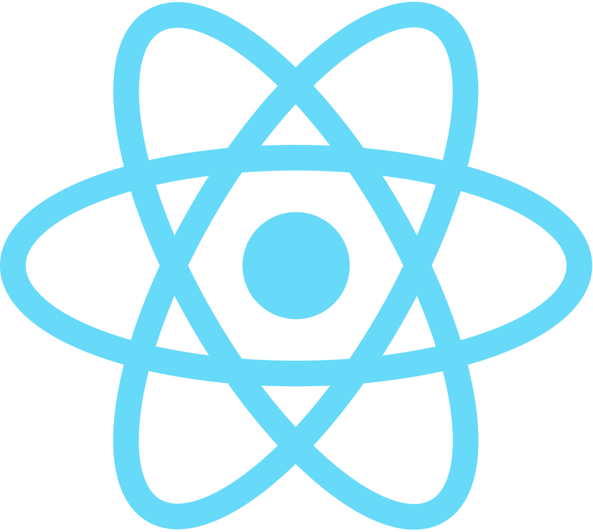
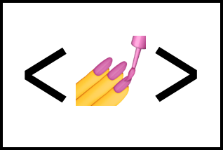

# Hi there 👋

## I'm Andrew Crescencio a Frontend Web Developer from São Paulo (but soon i'll learn backend too).

## 🛠  Technologies and tools

# I'm still arranging...

[][tech_tools_anchor]
&nbsp;
[][tech_tools_anchor]
&nbsp;
[][tech_tools_anchor]
&nbsp;
[][tech_tools_anchor]
&nbsp;
[][learning_next_anchor]
&nbsp;
[][tech_tools_anchor]
&nbsp;
[][tech_tools_anchor]
&nbsp;
[][tech_tools_anchor]
&nbsp;
[][tech_tools_anchor]

<!--
**AndrewCrescencio/andrewcrescencio** is a ✨ _special_ ✨ repository because its `README.md` (this file) appears on your GitHub profile.

Here are some ideas to get you started:

- 🔭 I’m currently working on ...
- 🌱 I’m currently learning ...
- 👯 I’m looking to collaborate on ...
- 🤔 I’m looking for help with ...
- 💬 Ask me about ...
- 📫 How to reach me: ...
- 😄 Pronouns: ...
- ⚡ Fun fact: ...
-->

[tech_tools_anchor]: #hi--
[learning_now_anchor]: #technologioes-tools
[learning_next_anchor]: #learning-next
